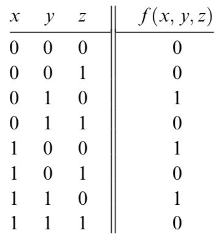
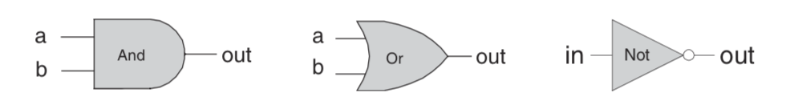
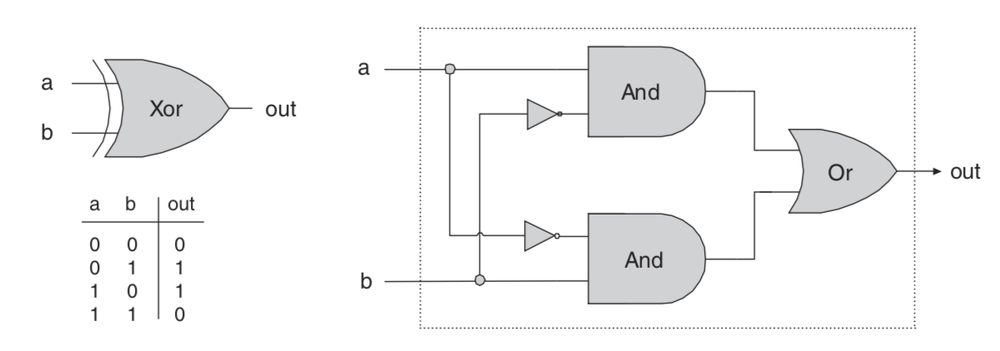
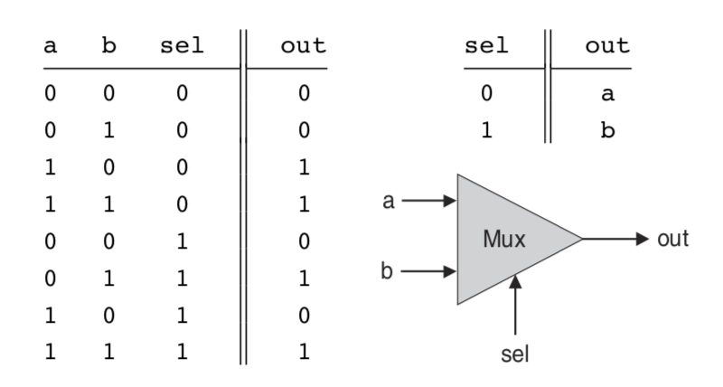
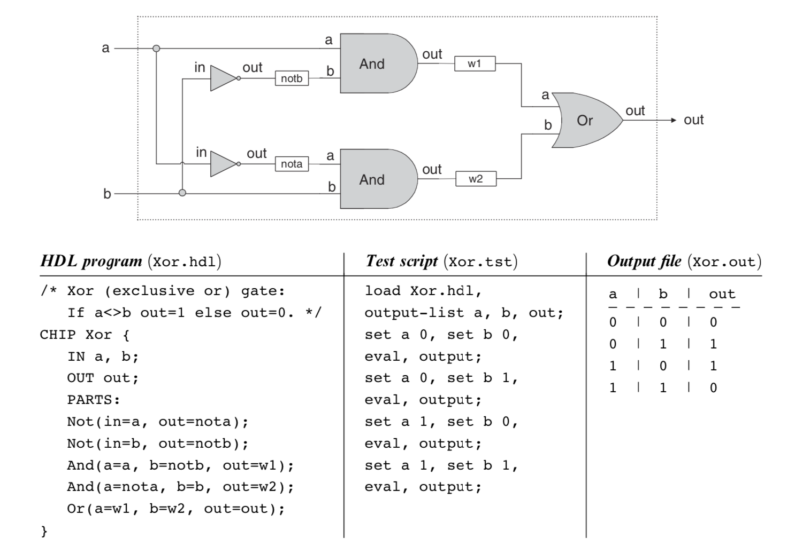

## Boolean Logic

1. Every digital device is made from the same building blocks: **Elementary logic gates**;
2. Nand can build all the other logic gate from itself;


### Boolean Algebra


1. **Boolean algebra** deals with Boolean (also called binary) values that are typically labeled true/false, 1/0, yes/no, on/off, and so forth
2. **A Boolean function** is a function that operates on binary inputs and returns binary outputs.

- Infinitely many Boolean expressions vs. only a finite number of Boolean functions
- Infinitely many Boolean expressions are equivalent to the same Boolean function
- Boolean values are the two logic constants True, and False. 
-  for n independent Boolean variables, each taking one particular Boolean value, there are $2^n$ different possible combinations. A Boolean function has to assign one Boolean value to each one of these combinations. This brings the number of different possible Boolean functions of n variables to a total of $2^{2^n}$
- 


3. Boolean Identities


### two ways to represent the boolean functions

1. **Truth Table Representation**: The simplest way to specify a Boolean function is to enumerate all the possible values of the function’s input variables, along with the function’s output for each set of inputs.

 

2. **Boolean Expressions**: a Boolean function can also be specified using Boolean operations over its input variables

$$f(x,y,z) = (x + y) * \bar(z)$$

#### Canonical Representation
Every Boolean function, no matter how complex, can be expressed using three Boolean operators only: And, Or, and Not.

example: for the figure above, we can get
$$f(x,y,z) = \bar(x)y\bar(z) + x\bar(y)\bar(z) + xy\bar(z)$$

find all the expressions euqual to 1, use "and" conbines the bits together and use "or" conbine all the expressions.


## Gate Logic

A gate is a physical device that implements a Boolean function. If a Boolean function f operates on n variables and returns m binary results (in all our examples so far, m was 1), the gate that implements f will have n input pins and m output pins.

Each one of the operations And, Or, and Not can be constructed from it, and it alone (e.g., x Or y = (x Nand x) Nand (y Nand y). And since every Boolean function can be constructed from And, Or, and Not operations using the canonical representation method, it follows that every Boolean function can be constructed from Nand operations alone

### Primitive and Composite Gates
a primitive gate (see figure 1.3) can be viewed as a black box device that implements an elementary logical operation in one way or another—we don’t care how. Computer scientists can be content with the **abstract notions** of Boolean algebra and gate logic, trusting that someone else (the physicists and electrical engineers—bless their souls) will figure out how to actually realize them in hardware


We see that any given logic gate can be viewed from two different perspectives: external and internal. As the blow picture a example. The right-hand side of figure gives the gate’s internal architecture, or **implementation**, whereas the left side shows only the gate **interface**. The gate implementation will realize its stated interface, in one way or another.




### Multi-Bit Versions of Basic Gates

Computer hardware is typically designed to operate on multi-bit arrays called **buses**.

or example, a basic requirement of a 32-bit computer is to be able to compute (bit-wise) an And function on two given 32-bit buses. To implement this operation, we can build an array of 32 binary And gates, each operating separately on a pair of bits. In order to enclose all this logic in one package, we can encapsulate the gates array in a single chip interface consisting of two 32-bit input buses and one 32-bit output bus.

example, **Multi-Bit Not** An n-bit Not gate applies the Boolean operation Not to every one of the bits in its n-bit input bus:

```BASH
Chip name: Not16
Inputs: in[16] // a 16-bit pin Outputs: out[16]
Function: For i=0..15 out[i]=Not(in[i]).
```

### Multi-Way Versions of Basic Gates

any 2-way logic gates that accept two inputs have natural generalization to multi- way variants that accept an arbitrary number of inputs.

example, **Multi-Way Or An n-way Or** gate outputs 1 when at least one of its n bit inputs is 1, and 0 otherwise. Here is the 8-way variant of this gate:

```BASH
Chip name: Or8Way
Inputs: in[8]
Outputs: out
Function: out=Or(in[0],in[1],...,in[7]).
```


### Multiplexor

A multiplexor is a three-input gate that uses one of the inputs, called **selection bit**, to select and output one of the other two inputs, called **data bits**. Thus, a better name for this device might have been **selector**.



```BASH
Chip name: Mux
Inputs: a, b, sel
Outputs: out
Function: If sel=0 then out=a else out=b.
```

### Demultiplexor

A demultiplexor performs the opposite function of a multiplexor: It takes a single input and channels it to one of two possible outputs according to a selector bit that specifies which output to chose.

[](resources/Demultiplexor.png)

```BASH
Chip name: DMux
Inputs: in, sel
Outputs: a, b
Function: If sel=0 then {a=in, b=0} else {a=0, b=in}.
```

## Hardware Description Language (HDL)

Thus, using HDL, one can completely plan, debug, and optimize the entire chip before a single penny is spent on actual production. When the HDL program is deemed complete, that is, when the performance of the simulated chip satisfies the client who ordered it, the HDL program can become the blueprint from which many copies of the physical chip can be stamped in silicon.


An HDL definition of a chip consists of a **header section** and a **parts section**. The header section specifies the chip interface, namely the chip name and the names of its input and output pins. The parts section describes the names and topol- ogy of all the lower-level parts (other chips) from which this chip is constructed


### HDL implementation of a Xor gate.



## Hardware Simulation

Since HDL is a hardware construction language, the process of writing and debug- ging HDL programs is quite similar to software development. The main difference is that instead of writing code in a language like Java, we write it in HDL, and instead of using a compiler to translate and test the code, we use a hardware simulator. The hardware simulator is a computer program that knows how to parse and interpret HDL code, turn it into an executable representation, and test it according to the specifications of a given test script

