Table of Contents
=================

   * [Boolean Arithmetic](#boolean-arithmetic)
      * [Binary numbers](#binary-numbers)
      * [Addition](#addition)
      * [Building an Adder](#building-an-adder)
         * [Half adder](#half-adder)
         * [Full adder](#full-adder)
         * [Multi-bit Adder](#multi-bit-adder)
      * [Negative numbers](#negative-numbers)
      * [Arithmetic Logic Unit](#arithmetic-logic-unit)
         * [Von Neumann Architecture](#von-neumann-architecture)
         * [The Hack ALU](#the-hack-alu)


# Boolean Arithmetic

## Binary numbers

1. Representing numbers

$$b_{n}b_{n-1}b_{n-2}\cdots b_{1}b_{0}$$

2. Binary to Decimal

$$ \sum_{i=0}^{n}b_{i} * 2^{i}$$

3. Maximum value represented by k bits

$$1+2+4+8+\cdots +2^{k-1} = 2^{k}-1$$

4. Decimal to Binary

以十进制的数除以所要转换的进制数,把每次除得的余数保留,所得的商数继续除以进制数,直到余数为0时止.

- 如把100转换成八进制: 
```BASH
100/8=12...4
12/8=1.....4
1/8=0......1
#把相应的余数从低向高顺着写出来,如上的为144,此即为100的八进制表示形式. 
```
- 如100转换为十六进制: 
```BASH
100/16=6....4 
6/16=0......6
``` 
- 如100转换为二进制: 
```BASH
100/2=50....0
50/2=25.....0
25/2=12.....1
12/2=6......0
6/2=3.......0
3/2=1.......1
1/2=0.......1
#所以100的二进制表示形式为1100100; 
```

## Addition

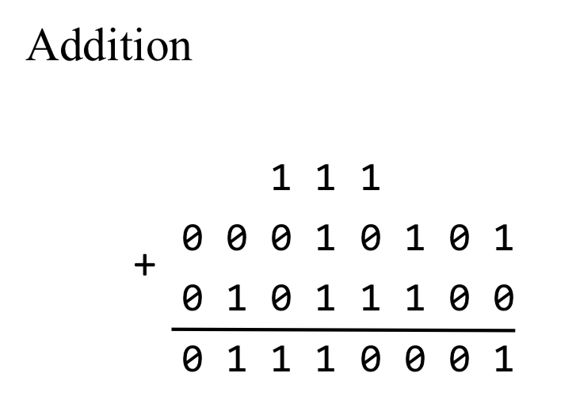
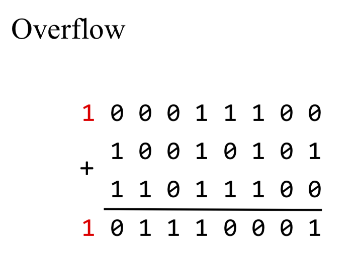

## Building an Adder
- Half adder: adds two bits
- Full adder: adds three bits
- Adder: adds two integers

### Half adder
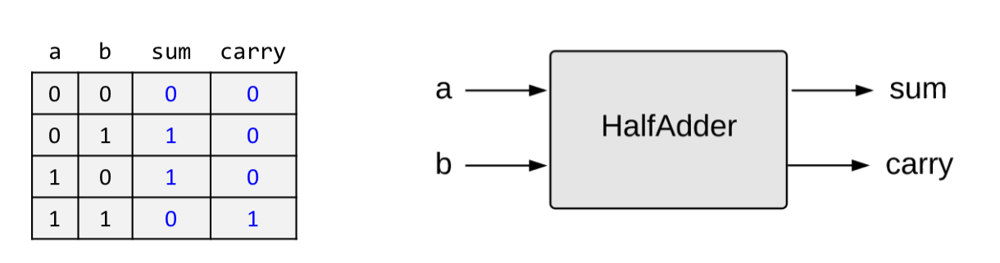
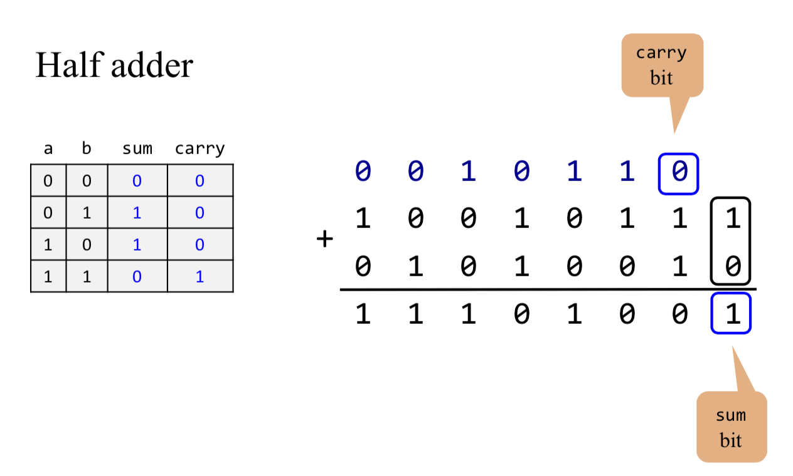

```BASH

/**
 * Computes the sum of two bits.
 */

CHIP HalfAdder {
    IN a, b;    // 1-bit inputs
    OUT sum,    // Right bit of a + b 
        carry;  // Left bit of a + b

    PARTS:
    // Put you code here:
    Xor(a=a,b=b,out=sum);
    And(a=a,b=b,out=carry);
}

```

### Full adder

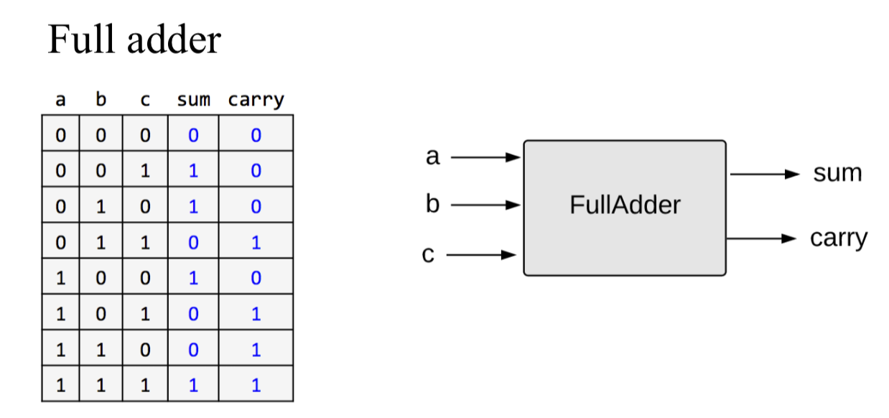
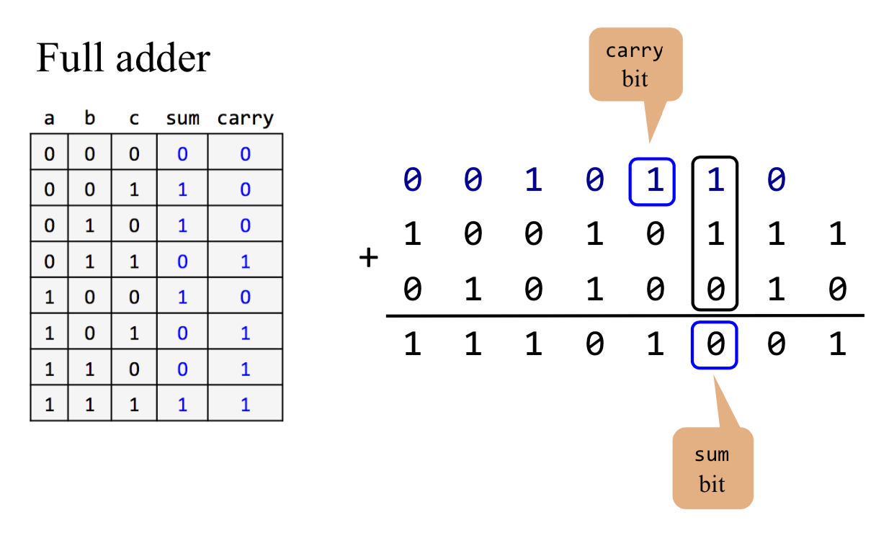

```BASH
 /**
 * Computes the sum of three bits.
 */

CHIP FullAdder {
    IN a, b, c;  // 1-bit inputs
    OUT sum,     // Right bit of a + b + c
        carry;   // Left bit of a + b + c

    PARTS:
    // Put you code here:
    HalfAdder(a=a,b=b,sum=sum1,carry=carry1);
    HalfAdder(a=c,b=sum1,sum=sum,carry=carry2);
    Or(a=carry1,b=carry2,out=carry);
    
}
```

### Multi-bit Adder
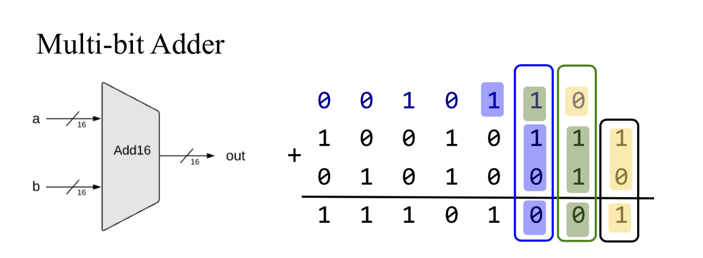

```BASH
/**
 * Adds two 16-bit values.
 * The most significant carry bit is ignored.
 */

CHIP Add16 {
    IN a[16], b[16];
    OUT out[16];

    PARTS:
   // Put you code here:
    HalfAdder(a=a[0],b=b[0],sum=out[0],carry=carry1);
    FullAdder(a=a[1],b=b[1],c=carry1,sum=out[1],carry=carry2);
    FullAdder(a=a[2],b=b[2],c=carry2,sum=out[2],carry=carry3);
    FullAdder(a=a[3],b=b[3],c=carry3,sum=out[3],carry=carry4);
    FullAdder(a=a[4],b=b[4],c=carry4,sum=out[4],carry=carry5);
    FullAdder(a=a[5],b=b[5],c=carry5,sum=out[5],carry=carry6);
    FullAdder(a=a[6],b=b[6],c=carry6,sum=out[6],carry=carry7);
    FullAdder(a=a[7],b=b[7],c=carry7,sum=out[7],carry=carry8);
    FullAdder(a=a[8],b=b[8],c=carry8,sum=out[8],carry=carry9);
    FullAdder(a=a[9],b=b[9],c=carry9,sum=out[9],carry=carry10);
    FullAdder(a=a[10],b=b[10],c=carry10,sum=out[10],carry=carry11);
    FullAdder(a=a[11],b=b[11],c=carry11,sum=out[11],carry=carry12);
    FullAdder(a=a[12],b=b[12],c=carry12,sum=out[12],carry=carry13);
    FullAdder(a=a[13],b=b[13],c=carry13,sum=out[13],carry=carry14);
    FullAdder(a=a[14],b=b[14],c=carry14,sum=out[14],carry=carry15);
    FullAdder(a=a[15],b=b[15],c=carry15,sum=out[15],carry=carry16);
}
```

## Negative numbers

1. Possible Solution: use a sign bit

Use the left-most bit to represent the sign, -/+; Use the remaining bits to represent a positive number

```BASH
0000-----0
0001-----1
0010-----2
0011-----3
0100-----4
0101-----5
0110-----6
0111-----7
1000-----(-0)
1001-----(-1)
1010-----(-2)
1011-----(-3)
1100-----(-4)
1101-----(-5)
1110-----(-6)
1111-----(-7)
```

Complications:
- different representation of 0 and -0
- x + (-x) != 0
- more complication

2. Two's Complement
> Represent the negative number $-x$ using the positive number $2^n - x$

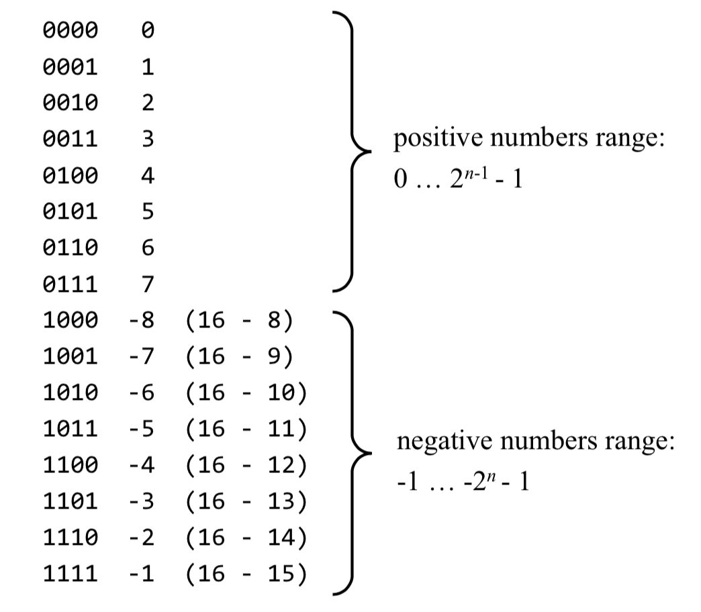

3. Computing $-x$

**Input**: x 
**Output**: -x (in two's complement)  
**Idea:**
$$2^{n} - x = 1 + (2^{n} - 1) - x$$

- $2^{n} - 1$ = 11111111_{2}$
- $11111111_{2} - x$ means **flip all the bits of x**
- 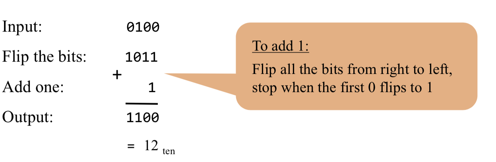

## Arithmetic Logic Unit

### Von Neumann Architecture
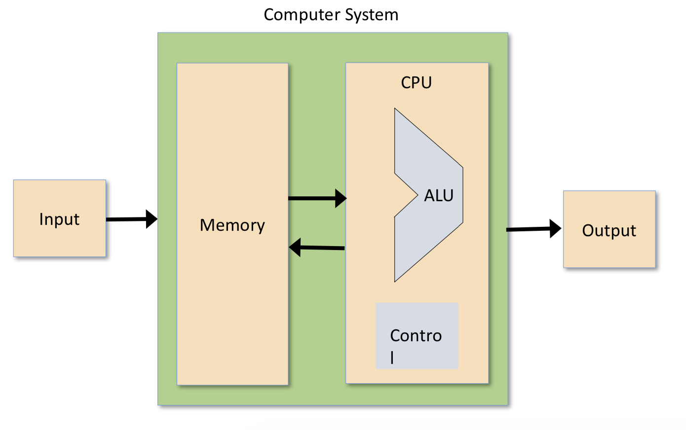

### The Hack ALU
!(ALU.png)

- The ALU computes a function on the two inputs, and outputs the result
- $f$: one out of a family of pre-defined arithmetic and logical functions
    - Arithmetic functions: integer addition, multiplication, division,...
    - logical functions: And, Or, Xor, ...
- Which functions should the ALU perform?
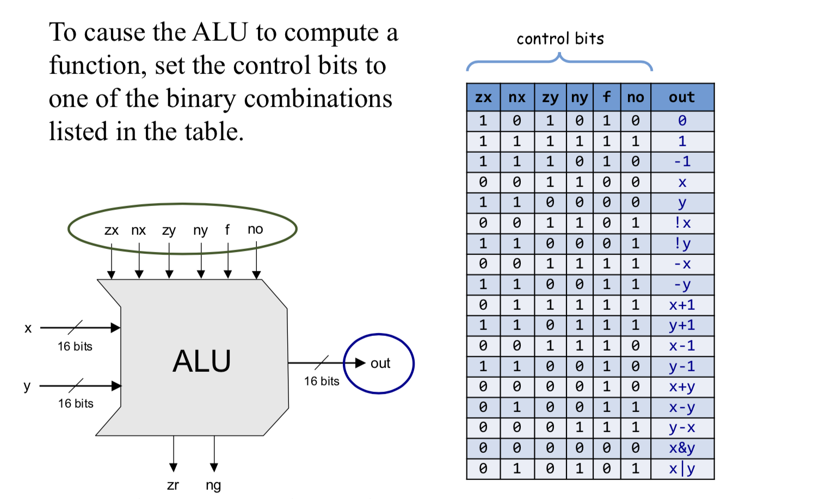

- two control bits 
```bash
if (out == 0) then zr = 1, else zr = 0 
if(out<0) thenng=1,else ng=0
```

- Example
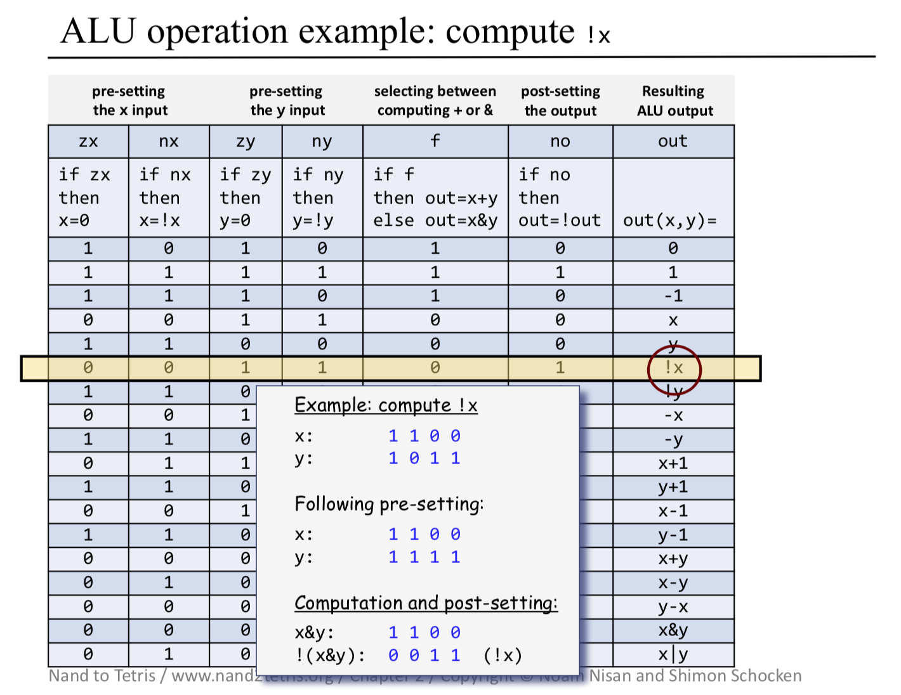
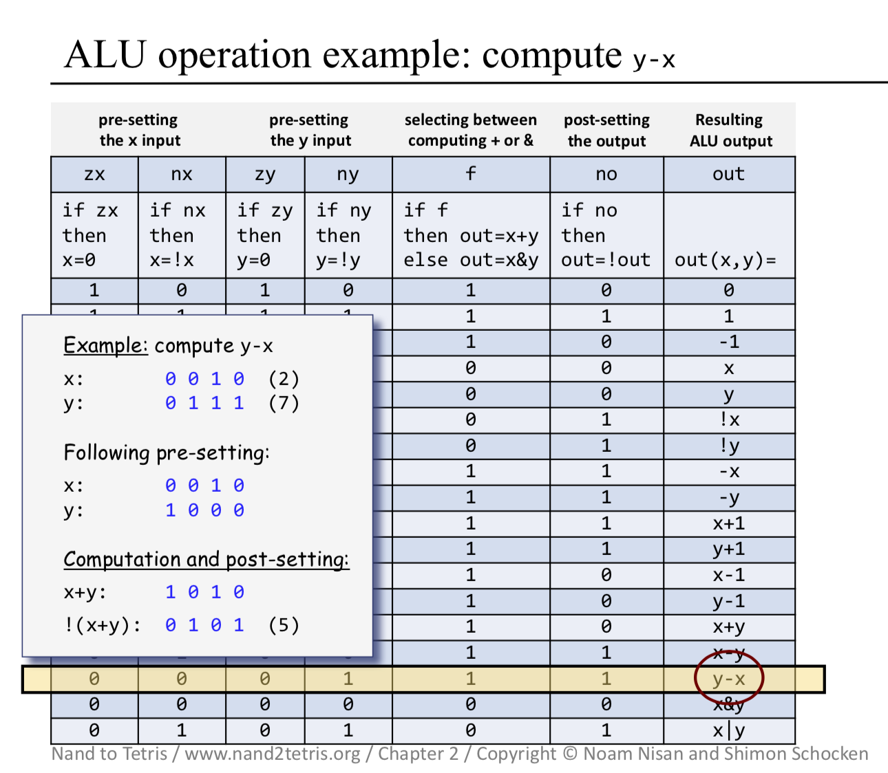

```BASH
/**
 * The ALU (Arithmetic Logic Unit).
 * Computes one of the following functions:
 * x+y, x-y, y-x, 0, 1, -1, x, y, -x, -y, !x, !y,
 * x+1, y+1, x-1, y-1, x&y, x|y on two 16-bit inputs, 
 * according to 6 input bits denoted zx,nx,zy,ny,f,no.
 * In addition, the ALU computes two 1-bit outputs:
 * if the ALU output == 0, zr is set to 1; otherwise zr is set to 0;
 * if the ALU output < 0, ng is set to 1; otherwise ng is set to 0.
 */

// Implementation: the ALU logic manipulates the x and y inputs
// and operates on the resulting values, as follows:
// if (zx == 1) set x = 0        // 16-bit constant
// if (nx == 1) set x = !x       // bitwise not
// if (zy == 1) set y = 0        // 16-bit constant
// if (ny == 1) set y = !y       // bitwise not
// if (f == 1)  set out = x + y  // integer 2's complement addition
// if (f == 0)  set out = x & y  // bitwise and
// if (no == 1) set out = !out   // bitwise not
// if (out == 0) set zr = 1
// if (out < 0) set ng = 1

CHIP ALU {
    IN  
        x[16], y[16],  // 16-bit inputs        
        zx, // zero the x input?
        nx, // negate the x input?
        zy, // zero the y input?
        ny, // negate the y input?
        f,  // compute out = x + y (if 1) or x & y (if 0)
        no; // negate the out output?

    OUT 
        out[16], // 16-bit output
        zr, // 1 if (out == 0), 0 otherwise
        ng; // 1 if (out < 0),  0 otherwise

    PARTS:
   // Put you code here:
   // if (zx==1) set x = 0
    Mux16(a=x,b=false,sel=zx,out=zxout);

    // if (zy==1) set y = 0
    Mux16(a=y,b=false,sel=zy,out=zyout); 

    // if (nx==1) set x = ~x
    // if (ny==1) set y = ~y  
    Not16(in=zxout,out=notx);
    Not16(in=zyout,out=noty);
    Mux16(a=zxout,b=notx,sel=nx,out=nxout); 
    Mux16(a=zyout,b=noty,sel=ny,out=nyout);

    // if (f==1)  set out = x + y 
    // if (f==0)  set out = x & y
    Add16(a=nxout,b=nyout,out=addout);
    And16(a=nxout,b=nyout,out=andout);
    Mux16(a=andout,b=addout,sel=f,out=fout);
    
    // if (no==1) set out = ~out
    // 1 if (out<0),  0 otherwise
    Not16(in=fout,out=nfout);
    Mux16(a=fout,b=nfout,sel=no,out=out,out[0..7]=zr1,out[8..15]=zr2,out[15]=ng);
    
    // 1 if (out==0), 0 otherwise
    Or8Way(in=zr1,out=or1);
    Or8Way(in=zr2,out=or2);
    Or(a=or1,b=or2,out=or3);
    Not(in=or3,out=zr);
}
```


