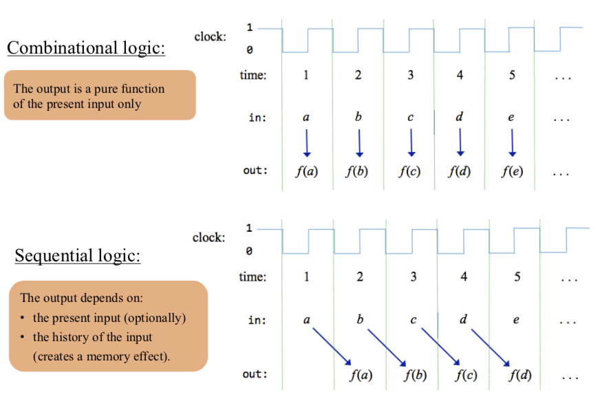
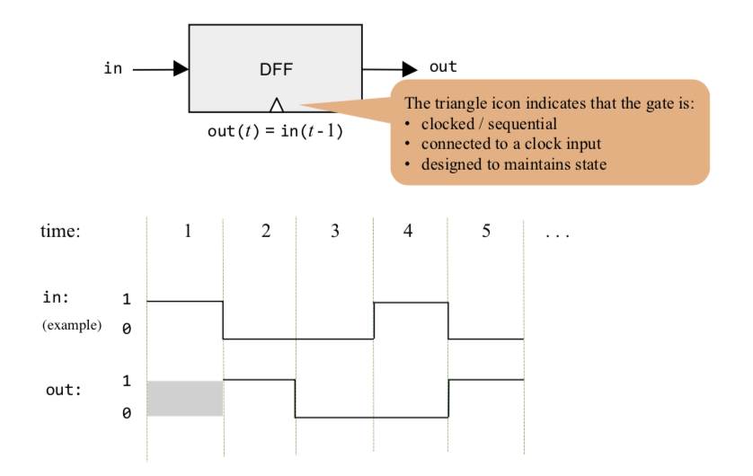
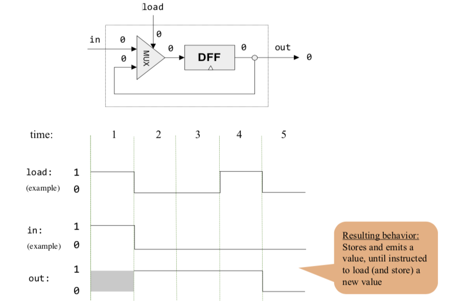
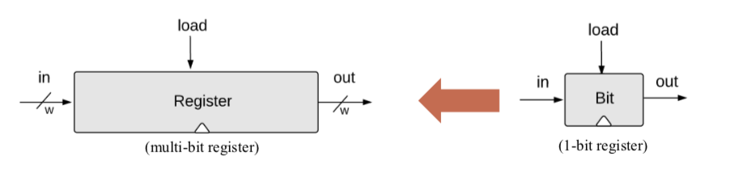
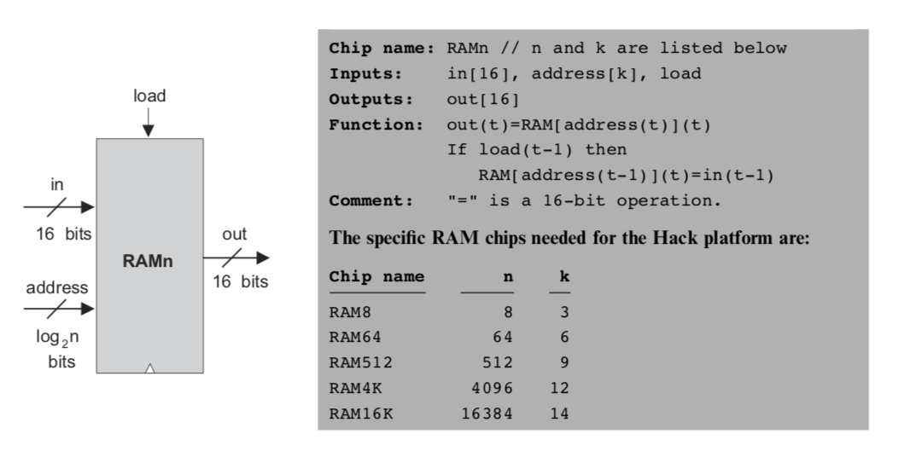
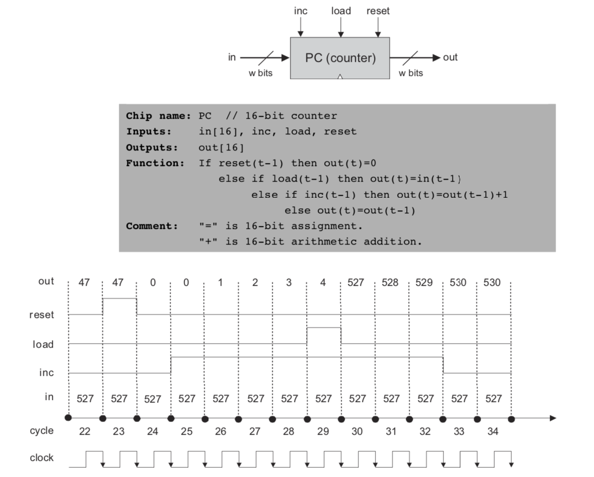

# Sequential Logic
**Combinational chips** compute functions that depend solely on combinations of their input values. These relatively simple chips provide many important processing functions (like the ALU), but they cannot **maintain state**. Since computers must be able to not only compute values but also store and recall values, they must be equipped with memory elements that can preserve data over time. These memory elements are built from **sequential chips**.




## Flip-Flop



- the DFF has a clock input that continuously changes according to the master clock’s signal.
- 1-bit input, 1-bit output
- Thegateoutputsitspreviousinput:

$$out(t)=in(t-1)$$

- Implementation: a gate that can flip between two stable states: **remembering 0**, or **remembering 1**
- Gates that feature this behavior are called data flip-flops.

## 1-bit register

A single-bit register, which we call Bit, or binary cell, is designed to **store** a single bit of information (0 or 1). The chip interface consists of 

- an **input pin** that carries a data bit;
- a **load pin** that enables the cell for writes;
- an **output pin** that emits the current state of the cell

### read/write behavior
- **Read**: To read the contents of a register, we simply probe its output.
- **Write**: To write a new data value d into a register, we put d in the in input and assert (set to 1) the load input. In the next clock cycle, the register commits to the new data value, and its output starts emitting d.




```bash
/**
 * 1-bit register:
 * If load[t] == 1 then out[t+1] = in[t]
 *                 else out does not change (out[t+1] = out[t])
 */

CHIP Bit {
    IN in, load;
    OUT out;

    PARTS:
    // Put your code here:

    Mux(a=dout,b=in, sel=load, out=out1);
    DFF(in=out1,out=dout,out=out);
}
```


## Multi-bit register (also known as “register”)

A w-bit register can be created from an array of w 1-bit registers.



```bash
/**
 * 16-bit register:
 * If load[t] == 1 then out[t+1] = in[t]
 * else out does not change
 */

CHIP Register {
    IN in[16], load;
    OUT out[16];

    PARTS:
    // Put your code here:
    Bit(in=in[0],load=load,out=out[0]);
    Bit(in=in[1],load=load,out=out[1]);
    Bit(in=in[2],load=load,out=out[2]);
    Bit(in=in[3],load=load,out=out[3]);
    Bit(in=in[4],load=load,out=out[4]);
    Bit(in=in[5],load=load,out=out[5]);
    Bit(in=in[6],load=load,out=out[6]);
    Bit(in=in[7],load=load,out=out[7]);
    Bit(in=in[8],load=load,out=out[8]);
    Bit(in=in[9],load=load,out=out[9]);
    Bit(in=in[10],load=load,out=out[10]);
    Bit(in=in[11],load=load,out=out[11]);
    Bit(in=in[12],load=load,out=out[12]);
    Bit(in=in[13],load=load,out=out[13]);
    Bit(in=in[14],load=load,out=out[14]);
    Bit(in=in[15],load=load,out=out[15]);
}
```

## Random Access Memory (RAM)

1. Architecture
A sequence of n addressable registers, with addresses 0 to n-1

2. The number of registers (n) and the width of each register (w) are called the memory’s **size** and **width**

3. Address width
$$k = log_2 n$$

4. To read Register i:
    - set address = i
    - probe out

5. To set Register i to v:
    - set address = i
    - set in = v 
    - set load = 1




```bash
/**
 * Memory of 8 registers, each 16 bit-wide. Out holds the value
 * stored at the memory location specified by address. If load=1, then 
 * the in value is loaded into the memory location specified by address 
 * (the loaded value will be emitted to out after the next time step.)
 */

CHIP RAM8 {
    IN in[16], load, address[3];
    OUT out[16];

    PARTS:
    DMux8Way(in=load,sel=address,a=load0,b=load1,c=load2,d=load3,e=load4,f=load5,g=load6,h=load7);
    Register(in=in,load=load0,out=out0);
    Register(in=in,load=load1,out=out1);
    Register(in=in,load=load2,out=out2);
    Register(in=in,load=load3,out=out3);
    Register(in=in,load=load4,out=out4);
    Register(in=in,load=load5,out=out5);
    Register(in=in,load=load6,out=out6);
    Register(in=in,load=load7,out=out7);
    Mux8Way16(a=out0,b=out1,c=out2,d=out3,e=out4,f=out5,g=out6,h=out7,sel=address,out=out);
}
```

## Program Counter

- The computer must keep track of which instruction should be fetched and executed next
- This control mechanism can be realized by a register called Program Counter
- The PC contains the address of the instruction that will be fetched and executed next
- The PC is designed to support three possible control operations:
    1. **Reset**: fetch the first instruction (PC = 0)
    2. **Next**: fetch the next instruction (PC++)
    3. **Goto**: fetch instruction n(PC = n)




```bash
/**
 * A 16-bit counter with load and reset control bits.
 * if      (reset[t] == 1) out[t+1] = 0
 * else if (load[t] == 1)  out[t+1] = in[t]
 * else if (inc[t] == 1)   out[t+1] = out[t] + 1  (integer addition)
 * else                    out[t+1] = out[t]
 */

CHIP PC {
    IN in[16],load,inc,reset;
    OUT out[16];

    PARTS:
    // Put your code here:
    Inc16(in=out5,out=out1);
    Mux16(a=out5,b=out1,sel=inc,out=out2);
    Mux16(a=out2,b=in,sel=load,out=out3);
    Mux16(a=out3,b=false,sel=reset,out=out4);
    Register(in=out4,load=true,out=out5,out=out);

}

```