Table of Contents
=================

   * [Table of Contents](#table-of-contents)
      * [Background](#background)
      * [Machine languages](#machine-languages)
         * [Mnemonics](#mnemonics)
         * [Commands](#commands)
         * [Arithmetic and Logic Operations](#arithmetic-and-logic-operations)
         * [Memory Access](#memory-access)
         * [Compilation](#compilation)
      * [The Hack language specification](#the-hack-language-specification)
         * [The A-Instruction](#the-a-instruction)
         * [The C-Instruction](#the-c-instruction)
            * [The Computation Specification(comp)](#the-computation-specificationcomp)
         * [The Destination Specification](#the-destination-specification)
         * [The Jump Specification](#the-jump-specification)
         * [Symbols](#symbols)
      * [Hack programs: symbolic and binary](#hack-programs-symbolic-and-binary)
      * [Input / Output](#input--output)
         * [Screen](#screen)
         * [Keyboard](#keyboard)
      * [Syntax Conventions and File Format](#syntax-conventions-and-file-format)
      * [Hack programming](#hack-programming)
         * [Hack assembly language (overview)](#hack-assembly-language-overview)
            * [Registers and memory](#registers-and-memory)
            * [Branching and Labels](#branching-and-labels)
            * [Variables](#variables)
            * [Iterative processing](#iterative-processing)
            * [Pointers](#pointers)

## Background
**Memory** The term memory refers loosely to the collection of hardware devices that store data and instructions in a computer. From the programmer’s standpoint, all memories have the same structure: A continuous array of cells of some fixed width, also called words or locations, each having a **unique address**.

**Processor**  The processor, normally called Central Processing Unit or CPU, is a device capable of performing a fixed set of elementary operations

**Registers**  Memory access is a relatively slow operation, requiring long instruction formats (an address may require 32 bits). For this reason, most processors are equipped with several registers, each capable of holding a single value. Located in the processor’s immediate proximity, the registers serve as a high-speed local memory, allowing the processor to manipulate data and instructions quickly. **This setting enables the programmer to minimize the use of memory access commands, thus speeding up the program’s execution.**


## Machine languages

> A machine language can be viewed as an agreed-upon formalism, designed to manipulate a memory using a processor and a set of registers.


### Mnemonics

For example, the language designer can decide that the operation code 1010 will be represented by the mnemonic add and that the registers of the machine will be symbolically referred to using the symbols R0, R1, R2, and so forth. Using these conventions, one can specify machine language instructions either directly, as 1010001100011001, or symbolically, as, say, ADD R3,R1,R9.

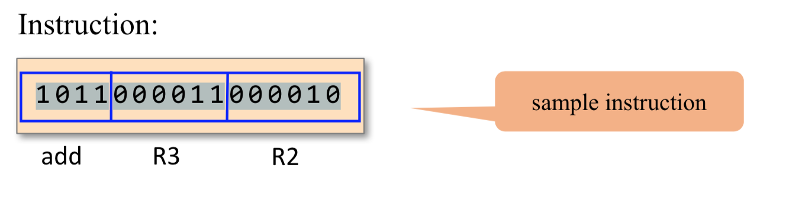

### Commands
Yet irrespective of this variety, all machine lan- guages support similar sets of generic commands, which we now describe.

### Arithmetic and Logic Operations

```ARM
ADD R2,R1,R3    // R2-<--R1+R3 where R1,R2,R3 are registers
ADD R2,R1,foo   // R2-<--R1+foo where foo stands for the 
                // value of the memory location pointed 
                // at by the user-defined label foo.
AND R1,R1,R2    // R1-<--bit wise And of R1 and R2
```

### Memory Access

Memory access commands fall into **two categories**. 
- First, as we have just seen, arithmetic and logical commands are allowed to operate not only on registers, but also on selected memory locations. 
- Second, all computers feature explicit load and store commands, designed to move data between registers and memory.

These memory access commands may use several types of **addressing modes** -- ways of specifying the address of the required memory word.

1. **Direct addressing**  The most common way to address the memory is to express a specific address or use a symbol that refers to a specific address, as follows

```ARM
LOAD R1,67  // R1-<--Memory[67]
            // Or, assuming that bar refers to memory address 67:
LOAD R1,bar // R1<--Memory[67]
```

2. **Immediate addressing**  This form of addressing is used to load constants— namely, load values that appear in the instruction code
```
LOADI R1,67 // R1<--67
```

3. **Indirect addressing**  In this addressing mode the address of the required memory location is not hard-coded into the instruction; instead, the instruction specifies a memory location that holds the required address.

```
// Translation of x=foo[j] or x=*(foo+j):
ADD R1, foo, j // R1<--foo+j
LOAD* R2,R1    // R2-<--Memory[R1] 
STR R2,x       // x-<--R2
```

4. **Flow of Control**  While programs normally execute in a linear fashion, one com- mand after the other, they also include occasional branches to locations other than the next command. Branching serves several purposes including **repetition** (jump backward to the beginning of a loop), **conditional execution** (if a Boolean condition is false, jump forward to the location after the ‘‘if-then’’ clause), and **subroutine** calling ( jump to the first command of some other code segment).

**Unconditional jump** commands like JMP beginWhile specify only the address of the target location
**Conditional jump** commands like JNG R1,endWhile must also specify a Boolean condition, expressed in some way.

```ARM
load R1,0
add 1, R1
...
// do something with R1 value ...
jmp 102 // goto 102
```
    
### Compilation
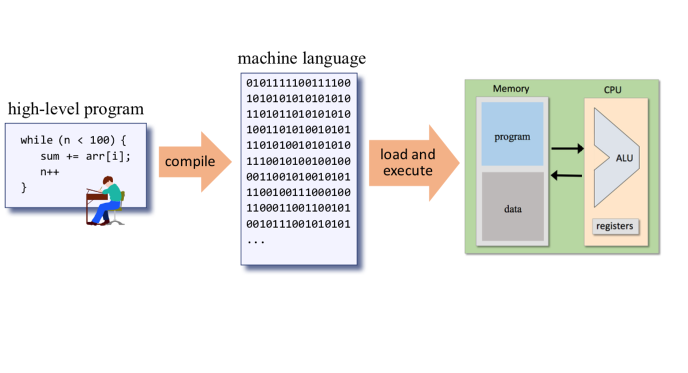                  


## The Hack language specification
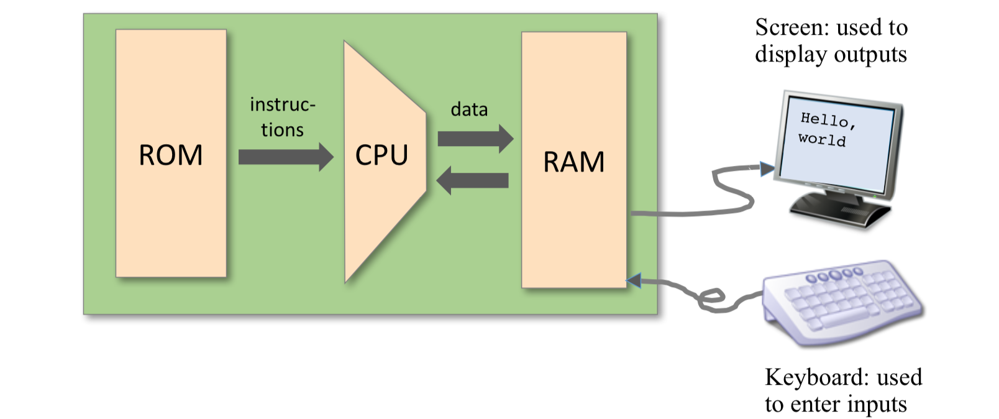

**Memory Address Spaces** The Hack computer is a von Neumann platform. It is a 16-bit machine, consisting of a CPU, two separate memory modules serving as **instruction memory** and **data memory**, and two memory-mapped I/O devices: a screen and a keyboard.The CPU can only execute programs that reside in the instruction memory.

**Register**
1. The Hack programmer is aware of two 16-bit registers called **D** and **A**. D is used solely to store data values, While A can be interpreted either as a data value, or as an address in the data memory.
2.  Since Hack instructions are 16-bit wide, and since addresses are specified using 15 bits, it is impossible to pack both an operation code and an address in one instruction. Thus, the syntax of the Hack language mandates that memory access instructions operate on an implicit memory location labeled **M**.
3.  the A register can be used to facilitate direct access to the data memory: the convention is that **M** always refers to the memory word whose address is the current value of the A register

    > eg: D = Memory[516] 􏰁- 1, we have to use one instruction to set the A register to 516, and a subsequent instruction to specify D=M-1.

4. facilitate direct access to the instruction memory: Hack jump instructions do not specify a particular address. Instead, the convention is that any jump operation always effects a jump to the instruction located in the memory word addressed by A.
5. **@value**, where value is either a number or a symbol representing a number. This command simply stores the specified value in the A register. 

### The A-Instruction

The A-instruction is used to set the A register to a 15-bit values
$$@valu$$
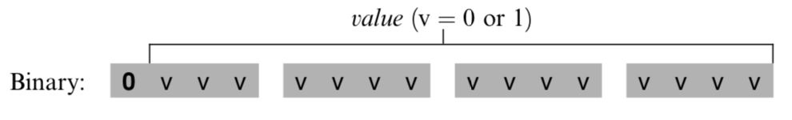

The A-instruction is used for three different purposes.
- it provides the only way to **enter a constant** into the computer under program control.
- it sets the stage for a subsequent C-instruction designed to manipulate a certain **data memory location**, by first setting A to the address of that location. 
- it sets the stage for a subsequent C-instruction that **specifies a jump**, by first loading the address of the jump destination to the A register


### The C-Instruction
The instruction code is a specification that answers three questions: 
- what to computer
- where to store the computed value
- what to do next

The overall semantics of the symbolic instruction dest=comp;jump is as follows. The **comp** field instructs the ALU what to compute. The **dest** field instructs where to store the computed value (ALU output).


#### The Computation Specification(comp)
The Hack ALU is designed to compute a fixed set of functions on the D, A, and M registers (where M stands for Memory[A]). 

Recall that the format of the C-instruction is 111accccccdd djjj. Suppose we want to have the ALU compute D-1, the current value of the D register minus 1. According to figure blow, this can be done by issuing the instruction 1110001110000000 (the 7-bit operation code is in bold). To compute the value of D|M, we issue the instruction 1111 010101000000. To compute the constant 􏰁1, we issue the instruction 1110111010000000, and so on.

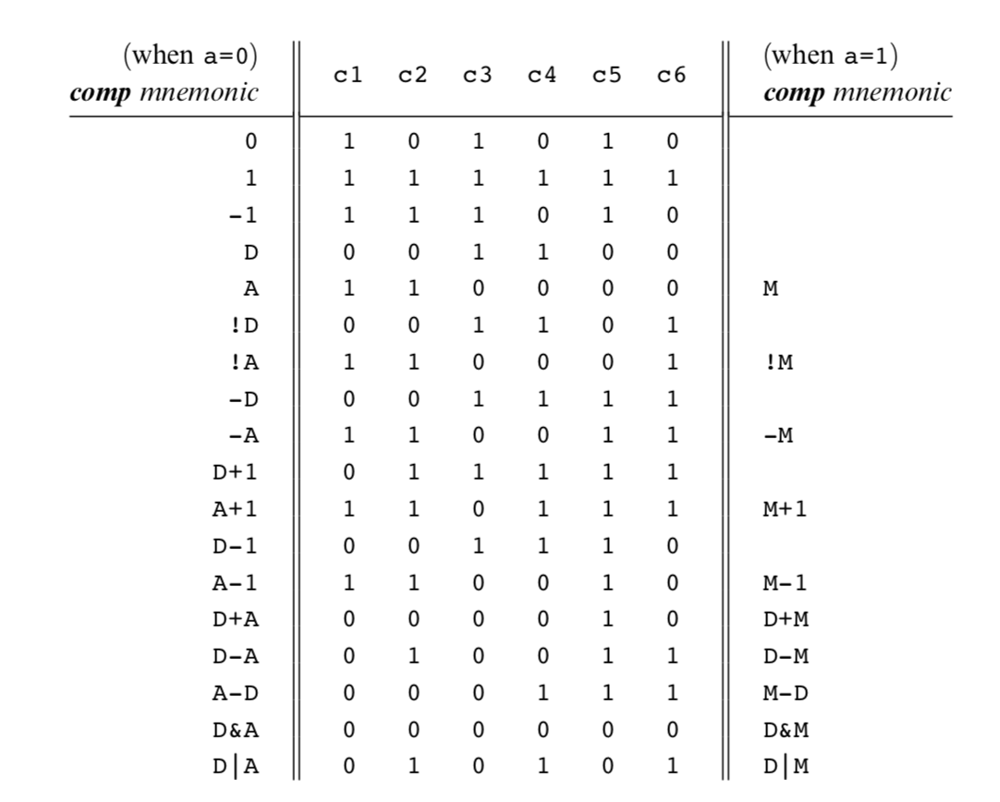


### The Destination Specification

The value computed by the comp part of the C- instruction can be stored in several destinations, as specified by the instruction’s 3-bit dest part.

Recall that the format of the C-instruction is 111a cccc ccdd djjj. Suppose we want the computer to increment the value of Memory[7] by 1 and to also store the result in the D register. According to figures 4.3 and 4.4, this can be accomplished by the following instructions:

```
0000 0000 0000 0111    // @7
1111 1101 1101 1000    // MD=M+1
```

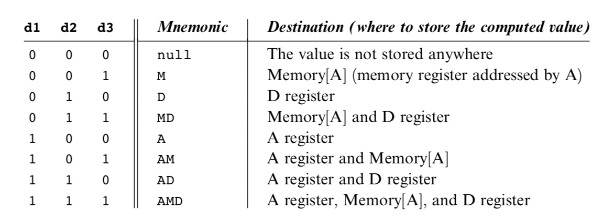
### The Jump Specification

The jump field of the C-instruction tells the computer what to do next.

```ARM
//  if Memory[3]=5 then goto 100 else goto 200

@3
D=M    // D=Memory[3]
@5
D=D-A  // D=D-5
@100
D;JEQ  // If D=0 goto 100
@200
0;JMP  // Goto 200
```

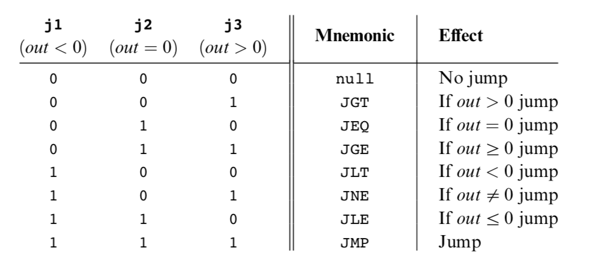

### Symbols

Assembly commands can refer to memory locations (addresses) using either constants or symbols. Symbols are introduced into assembly programs in the following three ways:

**Predefined symbols**: A special subset of RAM addresses can be referred to by any assembly program using the following predefined symbols.
- _Virtual registers_: To simplify assembly programming, the symbols R0 to R15 are predefined to refer to RAM addresses 0 to 15, respectively.
- _Predefined pointers_: The symbols SP, LCL, ARG, THIS, and THAT are predefined to refer to RAM addresses 0 to 4, respectively. Note that each of these memory locations has two labels. For example, address 2 can be referred to using either R2 or ARG. This syntactic convention will come to play in the implementation of the virtual machine, discussed in chapters 7 and 8.
- _I/O pointers_: The symbols SCREEN and KBD are predefined to refer to RAM addresses 16384 (0x4000) and 24576 (0x6000), respectively, which are the base addresses of the screen and keyboard memory maps. The use of these I/O devices is explained later.

**Label symbols**: These user-defined symbols, which serve to label destinations of goto commands, are declared by the pseudo-command ‘‘(Xxx)’’. This directive defines the symbol Xxx to refer to the instruction memory location holding the next command in the program. A label can be defined only once and can be used any- where in the assembly program, even before the line in which it is defined.

**Variable symbols**: Any user-defined symbol Xxx appearing in an assembly program that is not predefined and is not defined elsewhere using the ‘‘(Xxx)’’ command is treated as a variable, and is assigned a unique memory address by the assembler, starting at RAM address 16 (0x0010).

## Hack programs: symbolic and binary

[](resources/13.png)

## Input / Output

The Hack platform can be connected to two peripheral devices: a screen and a keyboard. Both devices interact with the computer platform through memory maps. **This means that drawing pixels on the screen is achieved by writing binary values into a memory segment associated with the screen**. Likewise, listening to the key- board is done by reading a memory location associated with the keyboard. The physical I/O devices and their memory maps are synchronized via continuous refresh loops.

- A designated memory area, dedicated to manage a display unit
- The physical display is continuously refreshed from the memory map, many times per second
- Output is effected by writing code that manipulates the screen memory map.

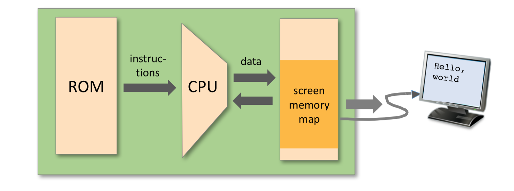

### Screen 
The Hack computer includes a black-and-white screen organized as 256 rows of 512 pixels per row. The screen’s contents are represented by an 8K memory map that starts at RAM address 16384 (0x4000). Each row in the physical screen, starting at the screen’s top left corner, is represented in the RAM by 32 consecutive 16-bit words. Thus the pixel at row r from the top and column c from the left is mapped on the c%16 bit (counting from LSB to MSB) of the word located at RAM[16384 + r \*􏰀 32 + c/16]. To write or read a pixel of the physical screen, one reads or writes the corresponding bit in the RAM-resident memory map (1 1⁄4 black, 0 1⁄4 white). Example:

```
// Draw a single black dot at the screen's top left corner:
@SCREEN  // Set the A register to point to the memory
         // word that is mapped to the 16 left-most
         // pixels of the top row of the screen.
M=1      // Blacken the left-most pixel.
```

!()[11.png]


**Task**: draw a filled rectangle at the upper left corner of the screen, 16 pixels wide and RAM[0] pixels long

```
// Pseudo code
// for (i=0; i<n; i++) {
//     draw 16 black pixels at the
//     beginning of row i
// }

addr = SCREEN n = RAM[0] i=0
LOOP:
if i > n goto END
RAM[addr] = -1 // 1111111111111111 // advances to the next row
addr = addr + 32
i=i+1
goto LOOP
END:
goto END

```

```ASM
@SCREEN
D=A
@addr
M=D  // addr = 16384
    // (screen’s base address)
@0
D=M
@n
M=D  // n = RAM[0]

@i
M=0 //i=0

(LOOP) 
    @i
    D=M
    @n
    D=D-M
    @END
    D;JGT  // if i>n goto END

    @addr
    A=M
    M=-1   // RAM[addr]=1111111111111111

    @i
    M=M+1 //i=i+1
    @32
    D=A
    @addr
    M=D+M // addr = addr + 32 @LOOP
    0;JMP // goto LOOP

(END)
    @END   // program’s end
    0;JMP
```


### Keyboard 
The Hack computer interfaces with the physical keyboard via a single-word memory map located in RAM address 24576 (0x6000). Whenever a key is pressed on the physical keyboard, its 16-bit ASCII code appears in RAM[24576]. When no key is pressed, the code 0 appears in this location. In addition to the usual ASCII codes, the Hack keyboard recognizes the keys shown in figure 4.6.

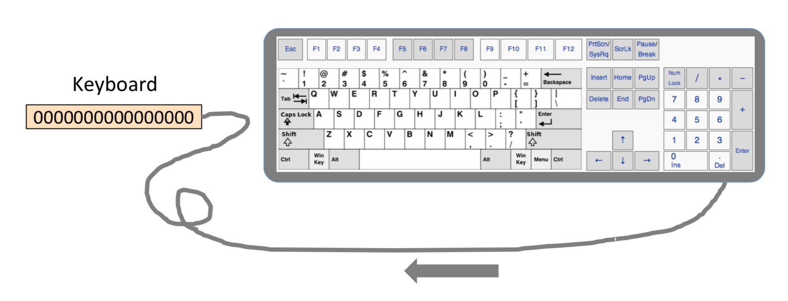

## Syntax Conventions and File Format


**Binary Code Files**  A binary code file is composed of text lines. Each line is a sequence of sixteen ‘‘0’’ and ‘‘1’’ ASCII characters, coding a single machine language instruction. Taken together, all the lines in the file represent a machine language program. The contract is such that when a machine language program is loaded into the computer’s instruction memory, the binary code represented by the file’s nth line is stored in address n of the instruction memory (the count of both program lines and memory addresses starts at 0). By convention, machine language programs are stored in text files with a ‘‘hack’’ extension, for example, Prog.hack.


**Assembly Language Files** By convention, assembly language programs are stored in text files with an ‘‘asm’’ extension, for example, Prog.asm. An assembly languages file is composed of text lines, each representing either an instruction or a symbol declaration:
- Instruction: an A-instruction or a C-instruction.
- (Symbol): This pseudo-command causes the assembler to assign the label Symbol to the memory location in which the next command of the program will be stored. It is called ‘‘pseudo-command’’ since it generates no machine code.


**Constants and Symbols** Constants must be non-negative and are always written in decimal notation. A user-defined symbol can be any sequence of letters, digits, underscore (\_), dot (.), dollar sign ($), and colon (:) that does not begin with a digit.

**Comments Text** beginning with two slashes (//) and ending at the end of the line is considered a comment and is ignored.

**White Space** Space characters are ignored. Empty lines are ignored.

**Case Conventions** All the assembly mnemonics must be written in uppercase. The rest (user-defined labels and variable names) is case sensitive. The convention is to use uppercase for labels and lowercase for variable names.


## Hack programming

### Hack assembly language (overview)
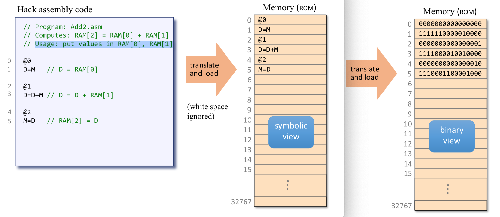
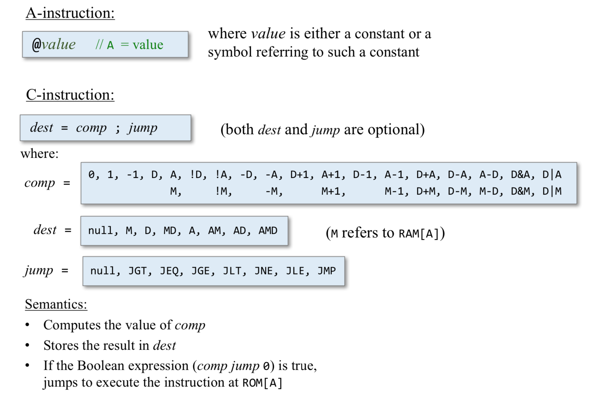

#### Registers and memory

- D: data register
- A: address / data register
- M: the currently selected memory register: M = RAM[A]

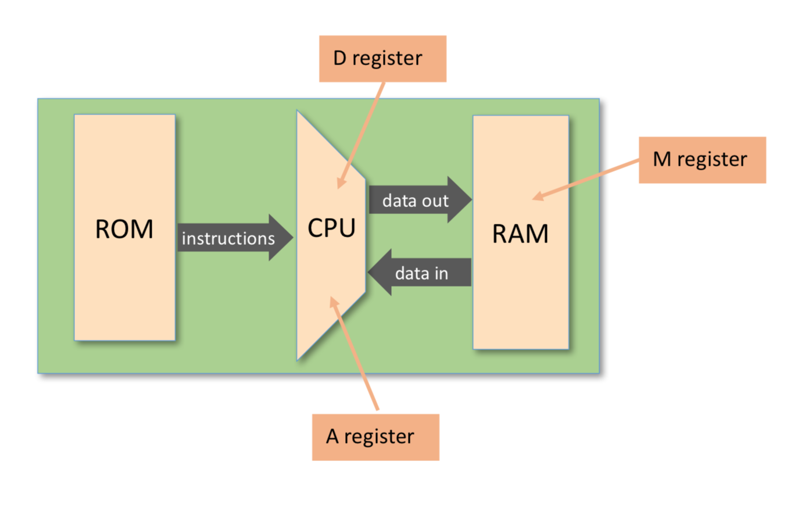

Typical operations:

```ARM
// D = 10
@10
D=A

// D++
D=D+1

// D=RAM[17]
@17
D=M

//RAM[17]=D
@17
M=D

// RAM[17]=10
@10
D=A
@17
M=D

// RAM[5] = RAM[3]
@3 
D=M 
@5
M=D
```

**Program example**: add two numbers
```ARM
// Program: Add2.asm
// Computes: RAM[2] = RAM[0] + RAM[1]
// Usage: put values in RAM[0], RAM[1]

@0
D=A

@1
D=D+M

@2
M=D
```

#### Branching and Labels
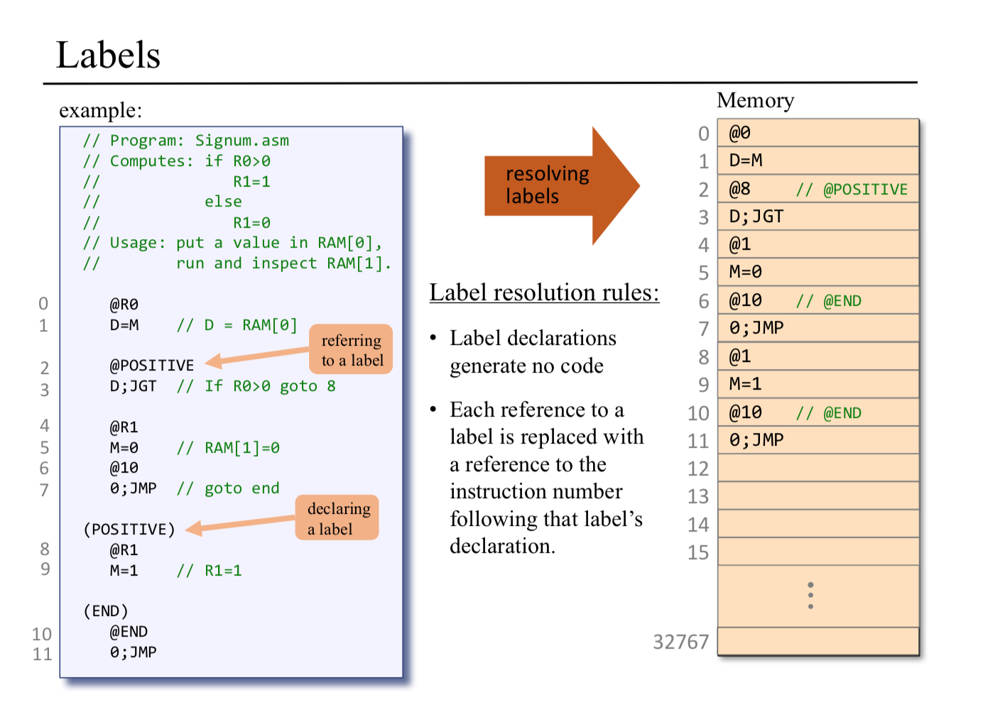


#### Variables
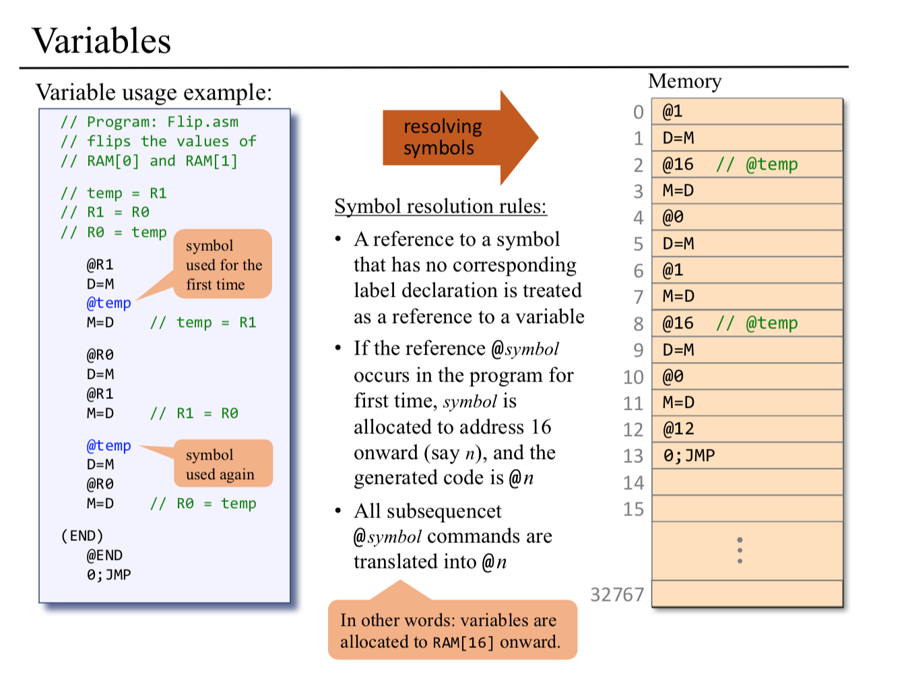


#### Iterative processing

```
// pseudo code
// Computes RAM[1] = 1+2+ ... +RAM[0]
n = R0 
i=1 
sum = 0

LOOP:
    if i > n goto STOP 
    sum = sum + i 
    i=i+1
    goto LOOP
STOP:
    R1 = sum
```

```ARM
// Computes RAM[1] = 1+2+ ... +n
// Usage: put a number (n) in RAM[0]
      @R0
      D=M
      @n
      M=D   // n = R0
      @i
      M=1   // i = 1
      @sum
      M=0   // sum = 0
(LOOP) @i
      D=M
      @n
      D=D-M
      @STOP
      D;JGT  // if i > n goto STOP
      @sum
      D=M
      @i
      D=D+M
      @sum
      M=D    // sum = sum + i
      @i
      M=M+1  // i = i + 1
      @LOOP
      0;JMP
(STOP) 
      @sum
      D=M
      @R1
      M=D    // RAM[1] = sum
(END) 
      @END
      0;JMP
```

#### Pointers

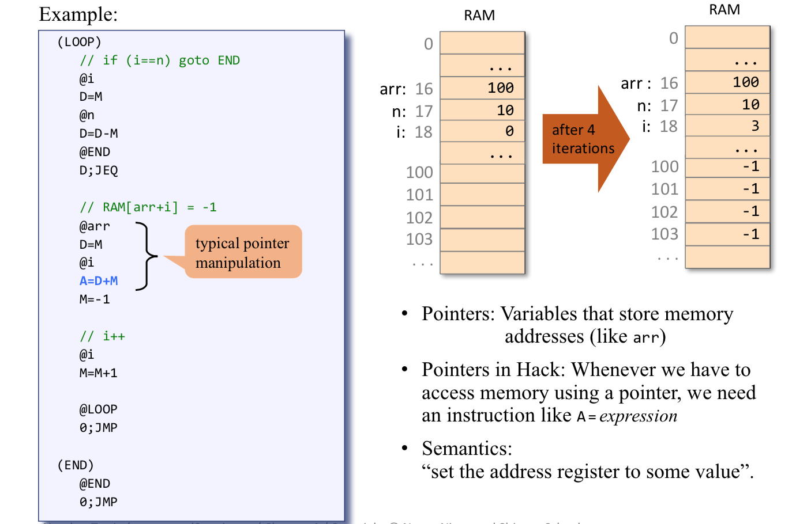
