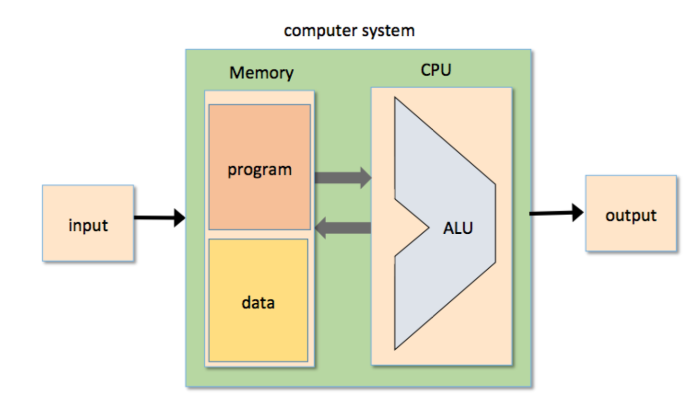
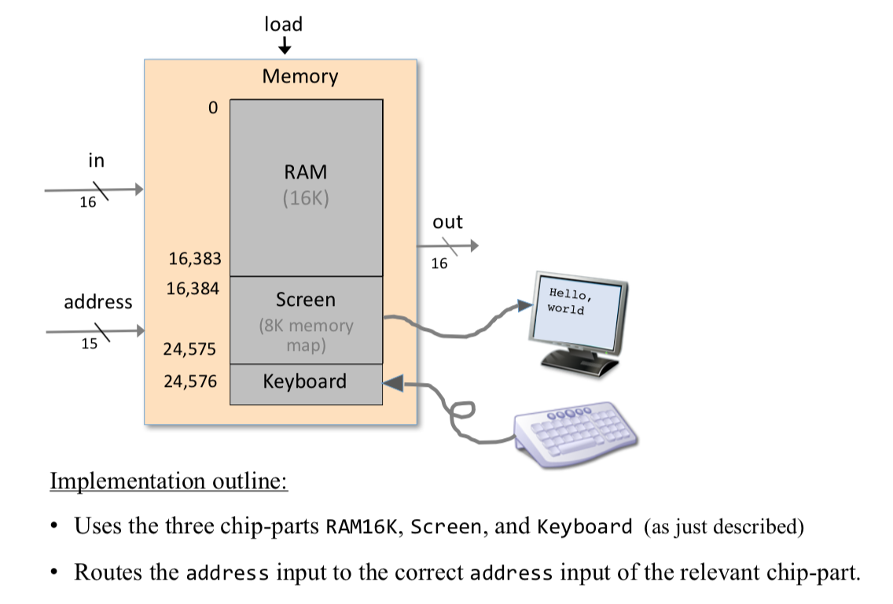
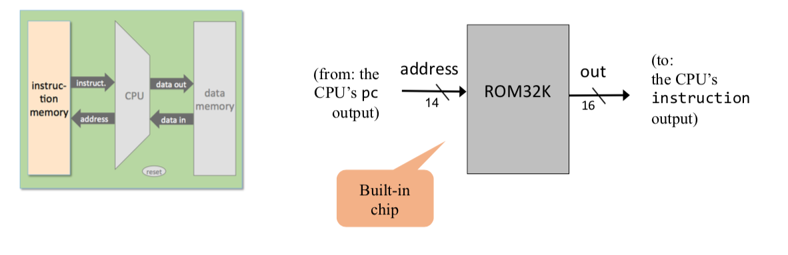
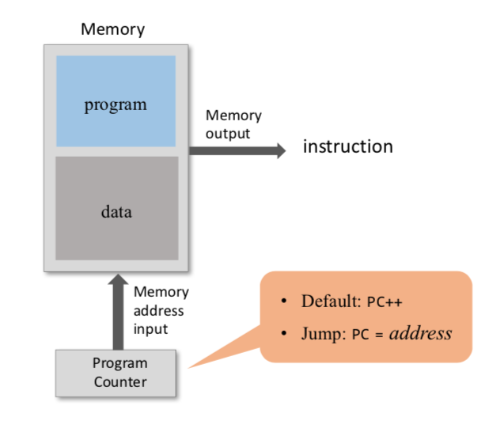
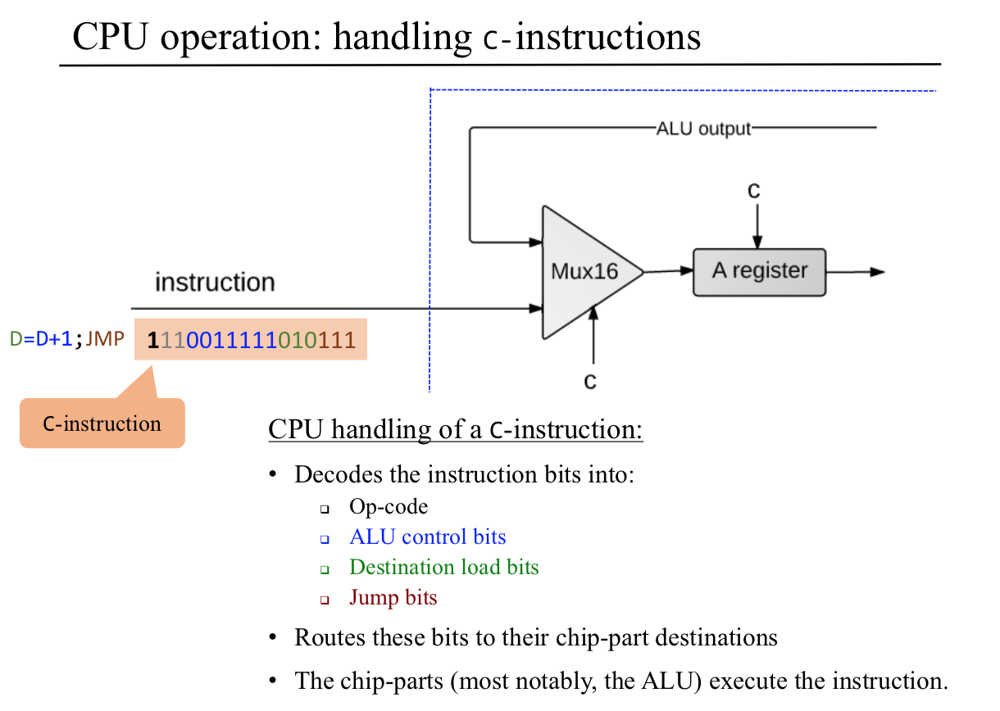
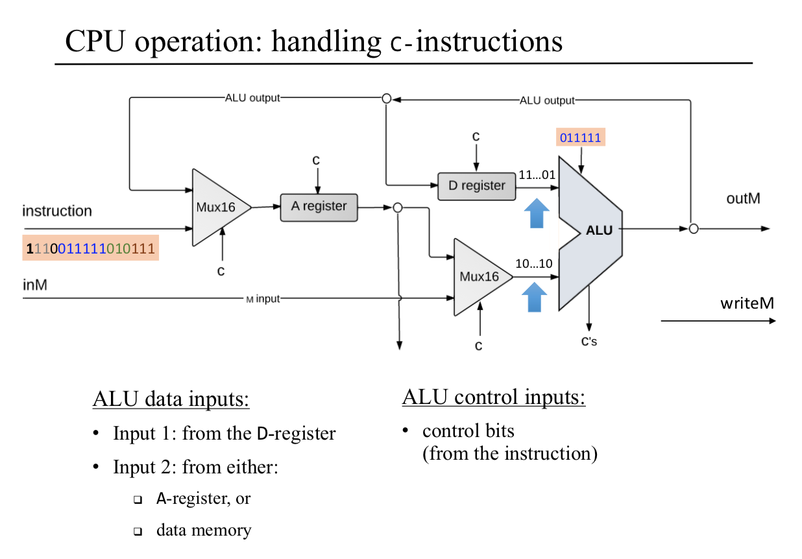
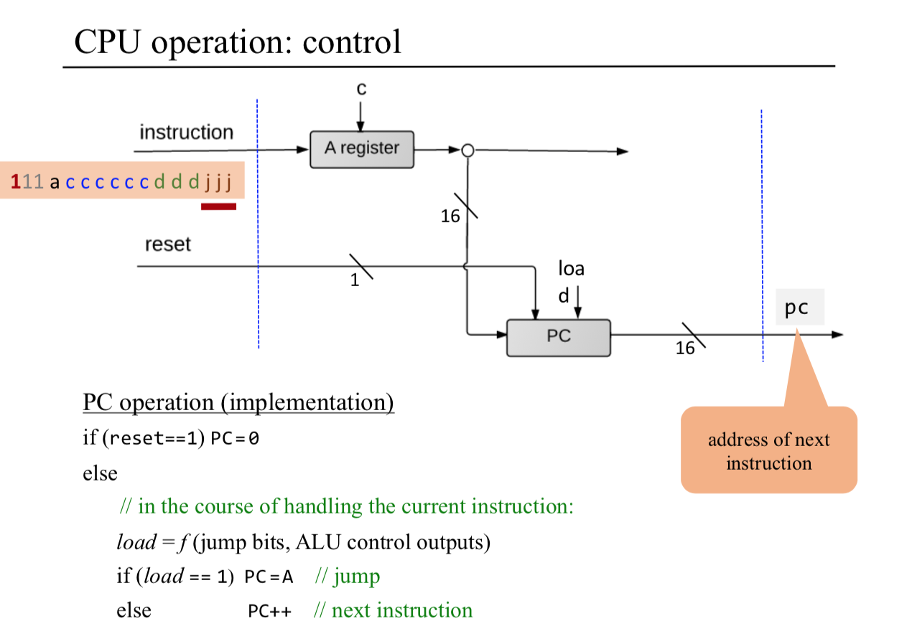
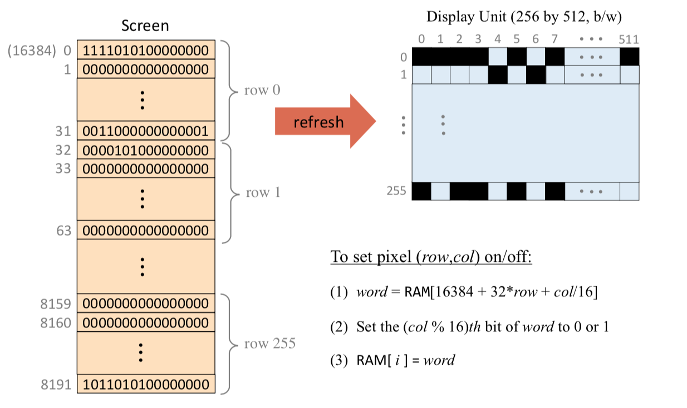
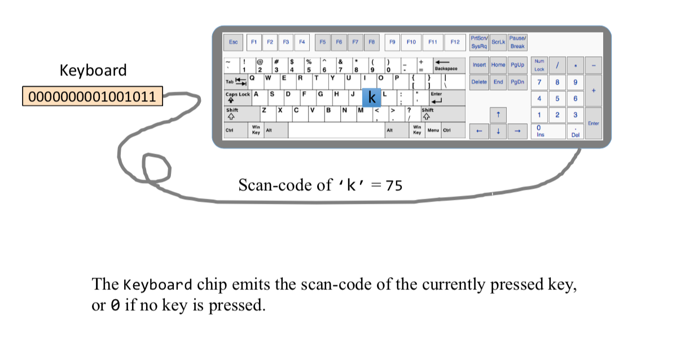
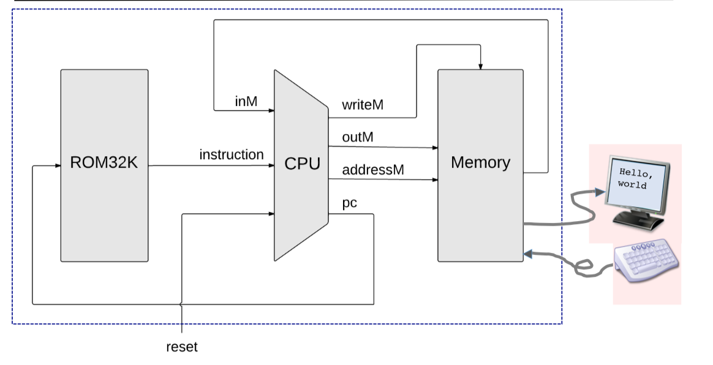

Table of Contents
=================

  * [Overview](#overview)
  * [The von Neumann Architecture](#the-von-neumann-architecture)
     * [Memory](#memory)
        * [Physical Perspective](#physical-perspective)
        * [Logical Perspective](#logical-perspective)
        * [Data Memory](#data-memory)
        * [Instruction Memory](#instruction-memory)
     * [Central Processing Unit(CPU)](#central-processing-unitcpu)
        * [Fetching](#fetching)
        * [Executing](#executing)
        * [Arithmetic Logic Unit](#arithmetic-logic-unit)
        * [Registers](#registers)
        * [Control Unit](#control-unit)
        * [CPU Operation](#cpu-operation)
     * [Registers](#registers-1)
        * [Data registers](#data-registers)
        * [Address registers](#address-registers)
        * [Program counter](#program-counter)
     * [Input and Output](#input-and-output)
        * [Screen](#screen)
     * [Keyboard](#keyboard)
  * [Hack Computer implementation](#hack-computer-implementation)


      
<blockquote class="blockquote-center">We ascribe beauty to that which is simple; which has no superfluous parts; which exactly answers its end; which stands related to all things; which is the mean of many extremes.<br><center>-- Ralph Waldo Emerson</center></blockquote>


## Overview 

This chapter is the pinnacle of the hardware part of our journey. We are now ready to take all the chips that we’ve built in chapters 1–3 and integrate them into a general-purpose computer system capable of running programs written in the machine language presented in chapter 4. The specific computer we will build, called Hack, has two important virtues. **On the one hand**, Hack is a simple machine that can be constructed in just a few hours, using previously built chips and the hardware simulator supplied with the book. **On the other hand**, Hack is sufficiently powerful to illustrate the key operating principles and hardware elements of any general-purpose computer. Therefore, building it will give you an excellent understanding of how modern computers work at the low hardware and software levels.


## The von Neumann Architecture



**The von Neumann machine is a practical architecture and the conceptual blueprint of almost all computer platforms today.**
At the heart of this architecture lies the **stored program concept**: The computer’s memory stores not only the data that the computer manipulates, but also the very instructions that tell the computer what to do. Let us explore this architecture in some detail.


### Memory

#### Physical Perspective
the memory is a linear sequence of addressable registers, each having a unique address and a value, which is a fixed-size word of information.

#### Logical Perspective
he memory is divided into two areas. One area is dedicated for storing data,e.g. the arrays and objects of programs that are presently executing, while the other area is dedicated for storing the programs’ instructions.

#### Data Memory
High-level programs manipulate abstract artifacts like variables, arrays, and objects. After the programs are translated into machine language, these data abstractions become binary codes, **stored in the computer’s memory**. Once an individual register has been selected from the memory by specifying its address, its contents can be either **read** or **written** to.





#### Instruction Memory
Before high-level programs can be executed on the computer, they must be translated into machine language. These instructions are stored in the computer’s instruction memory as binary codes. **In each step of a program’s execution, the CPU fetches (i.e., reads) a binary machine instruction from a selected register in the instruction memory, decodes it, executes the specified instruction, and figures out which instruction to fetch and execute next.**



```ARM
// This file is part of www.nand2tetris.org
// and the book "The Elements of Computing Systems"
// by Nisan and Schocken, MIT Press.
// File name: projects/05/Memory.hdl

/**
 * The complete address space of the Hack computer's memory,
 * including RAM and memory-mapped I/O. 
 * The chip facilitates read and write operations, as follows:
 *     Read:  out(t) = Memory[address(t)](t)
 *     Write: if load(t-1) then Memory[address(t-1)](t) = in(t-1)
 * In words: the chip always outputs the value stored at the memory 
 * location specified by address. If load==1, the in value is loaded 
 * into the memory location specified by address. This value becomes 
 * available through the out output from the next time step onward.
 * Address space rules:
 * Only the upper 16K+8K+1 words of the Memory chip are used. 
 * Access to address>0x6000 is invalid. Access to any address in 
 * the range 0x4000-0x5FFF results in accessing the screen memory 
 * map. Access to address 0x6000 results in accessing the keyboard 
 * memory map. The behavior in these addresses is described in the 
 * Screen and Keyboard chip specifications given in the book.
 */

CHIP Memory {
    IN in[16], load, address[15];
    OUT out[16];

    PARTS:
    //determine which one to load
    DMux(in=load,sel=address[14],a=ramload,b=skload);
    DMux(in=skload,sel=address[13],a=sload,b=nothing);

    //load ram and screen
    RAM16K(in=in,load=ramload,address=address[0..13],out=ramout);
    Screen(in=in,load=sload,address=address[0..12],out=screenout);
    
    //Deal with keyboard, make sure that all bits in [0..12] are 0
    Keyboard(out=kbd);
    Or8Way(in=address[0..7], out=notkbd1);
    Or8Way(in[0..4]=address[8..12], in[5..7]=false, out=notkbd2);
    Or(a=notkbd1,b=notkbd2,out=notkbd);
    Mux16(a=kbd,b=false,sel=notkbd,out=kbdout);

    //determine which is the output
    Mux16(a=ramout,b=outsk,sel=address[14],out=out);
    Mux16(a=screenout,b=kbdout,sel=address[13],out=outsk);
        
}
```


### Central Processing Unit(CPU)

The CPU—the centerpiece of the computer’s architecture—is in charge of executing the instructions of the currently loaded program.  The CPU executes these tasks using three main hardware elements: an **Arithmetic-Logic Unit (ALU)**, a set of **registers**, and a **control unit**.

The CPU operation can be described as a repeated loop: decode the current instruction, execute it, figure out which instruction to execute next, fetch it, decode it, and so on. This process is sometimes referred to as the **fetch-execute cycle**.


#### Fetching
1. Put the location of the next instruction in the Memory address input
2. Get the instruction code by reading the contents at that Memory location


#### Executing
The instruction code specifies **what to do**
- Which arithmetic or logical instruction to execute
- Which memory address to access (for read / write)
- If / where to jump
- ......

Executing the instruction involves:
- accessing registers
- accessing the data memory.


#### Arithmetic Logic Unit
- perform all the low-level arithmetic and logical operations
- Any function not supported by the ALU as a primitive hardware operation can be later realized by the computer’s system software


#### Registers
- store the intermediate results(rather than ship them in and out of the CPU chip and store them in RAM chip)
- typically equipped with a small set of 2 up to 32 resident high-speed registers, each capable of holding a single word.


#### Control Unit
- decoded binary instructions
- signal various hardware devices (ALU, registers, memory) how to execute the instructions.

#### CPU Operation





```ARM
// This file is part of www.nand2tetris.org
// and the book "The Elements of Computing Systems"
// by Nisan and Schocken, MIT Press.
// File name: projects/05/CPU.hdl

/**
 * The Hack CPU (Central Processing unit), consisting of an ALU,
 * two registers named A and D, and a program counter named PC.
 * The CPU is designed to fetch and execute instructions written in 
 * the Hack machine language. In particular, functions as follows:
 * Executes the inputted instruction according to the Hack machine 
 * language specification. The D and A in the language specification
 * refer to CPU-resident registers, while M refers to the external
 * memory location addressed by A, i.e. to Memory[A]. The inM input 
 * holds the value of this location. If the current instruction needs 
 * to write a value to M, the value is placed in outM, the address 
 * of the target location is placed in the addressM output, and the 
 * writeM control bit is asserted. (When writeM==0, any value may 
 * appear in outM). The outM and writeM outputs are combinational: 
 * they are affected instantaneously by the execution of the current 
 * instruction. The addressM and pc outputs are clocked: although they 
 * are affected by the execution of the current instruction, they commit 
 * to their new values only in the next time step. If reset==1 then the 
 * CPU jumps to address 0 (i.e. pc is set to 0 in next time step) rather 
 * than to the address resulting from executing the current instruction. 
 */

CHIP CPU {

    IN  inM[16],         // M value input  (M = contents of RAM[A])
        instruction[16], // Instruction for execution
        reset;           // Signals whether to re-start the current
                         // program (reset=1) or continue executing
                         // the current program (reset=0).

    OUT outM[16],        // M value output
        writeM,          // Write into M? 
        addressM[15],    // Address in data memory (of M)
        pc[15];          // address of next instruction

    PARTS:
    Mux16(a=instruction,b=ALUout,sel=instruction[15],out=Ain);
    
    Not(in=instruction[15],out=notinstruction);

    //RegisterA 
    //when instruction[15] = 0, it is @value means A should load value
    Or(a=notinstruction,b=instruction[5],out=loadA);//d1
    ARegister(in=Ain,load=loadA,out=Aout,out[0..14]=addressM);

    Mux16(a=Aout,b=inM,sel=instruction[12],out=AMout);

    //Prepare for ALU, if it is not an instruction, just return D
    And(a=instruction[11],b=instruction[15],out=zx);//c1
    And(a=instruction[10],b=instruction[15],out=nx);//c2
    Or(a=instruction[9],b=notinstruction,out=zy);//c3
    Or(a=instruction[8],b=notinstruction,out=ny);//c4
    And(a=instruction[7],b=instruction[15],out=f);//c5
    And(a=instruction[6],b=instruction[15],out=no);//c6

    ALU(x=Dout,y=AMout,zx=zx,nx=nx,zy=zy,ny=ny,f=f,no=no,out=outM,out=ALUout,zr=zero,ng=neg);

    //when it is an instruction, write M 
    And(a=instruction[15],b=instruction[3],out=writeM);//d3

    //RegisterD,when it is an instruction, load D
    And(a=instruction[15],b=instruction[4],out=loadD);//d2
    DRegister(in=ALUout,load=loadD,out=Dout);

    //Prepare for jump
    //get positive
    Or(a=zero,b=neg,out=notpos);
    Not(in=notpos,out=pos);

    And(a=instruction[0],b=pos,out=j3);//j3
    And(a=instruction[1],b=zero,out=j2);//j2
    And(a=instruction[2],b=neg,out=j1);//j1

    Or(a=j1,b=j2,out=j12);
    Or(a=j12,b=j3,out=j123);

    And(a=j123,b=instruction[15],out=jump);

    //when jump,load Aout 
    PC(in=Aout,load=jump,reset=reset,inc=true,out[0..14]=pc);
}
```

### Registers
CPU-resident registers save unnecessary memory access, and allow using thinner instruction formats, resulting in faster throughput.(saved ourselves a great deal of time and overhead)

#### Data registers
- calculate (a − b)\*c, temporary result(a - b) can be stored in some memory register.
- Typically, CPU’s use at least one and up to 32 data registers.


#### Address registers
- the output of an address register is typically connected to the address input of a memory device.
- set Memory[17] to 1. First set A=17(@17), followed by M=1(M mnemonic stand for Memory[17])
- In addition to supporting this fundamental addressing operation, an address register is, well, a register. Therefore, if needed, it can be used as yet another data register. D=17( @17, D=A)

#### Program counter
When executing a program, the CPU must always keep track of the address of the instruction that must be fetched and executed next. This address is kept in a special register called **program counter**.


### Input and Output
computer scientists have devised clever schemes to make all these different devices look exactly the same to the computer. The key trick in managing this complexity is called **memory-mapped I/O**.

- The basic idea is to create a binary emulation of the I/O device, making it “look” to the CPU as if it were a **regular memory segment.**
- each I/O device is allocated an exclusive area in memory, becoming its “memory map.”
- the data that drives each I/O device must be serialized. example: 2-dimensional grid of pixels, must be mapped on a 1-dimensional vector of fixed-size memory registers.


#### Screen


### Keyboard


## Hack Computer implementation



```ARM
// This file is part of www.nand2tetris.org
// and the book "The Elements of Computing Systems"
// by Nisan and Schocken, MIT Press.
// File name: projects/05/Computer.hdl

/**
 * The HACK computer, including CPU, ROM and RAM.
 * When reset is 0, the program stored in the computer's ROM executes.
 * When reset is 1, the execution of the program restarts. 
 * Thus, to start a program's execution, reset must be pushed "up" (1)
 * and "down" (0). From this point onward the user is at the mercy of 
 * the software. In particular, depending on the program's code, the 
 * screen may show some output and the user may be able to interact 
 * with the computer via the keyboard.
 */

CHIP Computer {

    IN reset;

    PARTS:
    CPU(instruction=instruction,reset=reset,inM=outMemo,outM=CPUoutM,writeM=wM,addressM=adM,pc=PC);
    Memory(in=CPUoutM,load=wM,address=adM,out=outMemo);
    ROM32K(address=PC,out=instruction);
}
```
