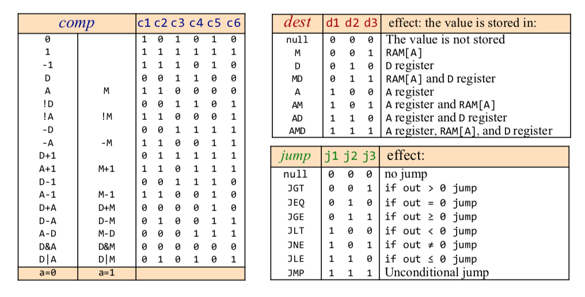

Table of Contents
=================

  * [Hack language specification](#hack-language-specification)
     * [A-instruction](#a-instruction)
     * [C-instruction](#c-instruction)
     * [Symbols(Pre-defined symbols)](#symbolspre-defined-symbols)
     * [A translator’s perspective](#a-translators-perspective)
  * [The assembly process: instructions](#the-assembly-process-instructions)
  * [The assembly process: symbols](#the-assembly-process-symbols)
  * [Symbol table](#symbol-table)
  * [The assembly process](#the-assembly-process)

## Hack language specification

### A-instruction

**Symbolic syntax** 
> @value

Where value is either
- a non-negative decimal constant
- a symbol referring to such a constant

**Example** 
> @21, @foo

**Binary syntax** 
> 0valueInBinary
**Example**: 
> 0000000000010101

### C-instruction

**Symbolic syntax** 
> dest = comp ; jump

**Binary syntax** 
> 1 1 1 a c1 c2 c3 c4 c5 c6 d1 d2 d3 j1 j2 j3

### Symbols(Pre-defined symbols)

Label declaration: (label)
Variable declaration: @variableName

The Hack language specification describes 23 pre-defined symbols

| Symbol  |  Value | Symbol  |  Value | 
|:--|:--|:--|:--|
| R0| 0 | SP| 0 |
| R1| 1 | LCL |  1 |
| R2| 2 | ARG | 2  |
|  ... | ...  | THIS| 3  |
| R15 | 15 |  THAT | 4 |
| SCREEN | 16384 | | |
| KBD |  24576 | | | |

### A translator’s perspective

Assembly program elements:

**White space**
- q Empty lines / indentation 
- Linecomments
- In-line comments

**Instructions**
- A-instructions
- C-instructions

**Symbols**
- References
- Label declarations

## The assembly process: instructions
For each instruction

1. Parse the instruction: break it into its underlying fields
2. A-instruction: translate the decimal value into a binary value
4. C-instruction: for each field in the instruction, generate the corresponding binary code;
5. Assemble the translated binary codes into a complete 16-bit machine instruction
6. Write the 16-bit instruction to the output file.

## The assembly process: symbols
1. Translating @preDefinedSymbol: **Replace preDefinedSymbol with its value.**
2. Label symbols
    - Used to label destinations of goto commands
    - Declared by the pseudo-command (XXX)
    - This directive defines the symbol XXX to refer to the memory location holding the next instruction in the program
    - Translating @labelSymbol : **Replace _labelSymbol_ with its value**

|||
|:--|:--|
|LOOP | 4|
|STOP | 18|
|END | 22|

3. Variable symbols
    - Any symbol XXX appearing in an assembly program which is **not** predefined and is not defined elsewhere using the (XXX) directive is treated as a variable
    - Each variable is assigned a unique memory address, starting at 16
    - Translating @variableSymbol :
        - If seen for the first time, assign a unique memory address
        - Replace _variableSymbol_ with this address

|||
|:--|:--|
|i | 16|
|sum | 17|

## Symbol table
To resolve a symbol, look up its value in the symbol table

## The assembly process
1. **Initialization**
- Construct an empty symbol table
- Add the pre-defined symbols to the symbol table

2. **First pass**
- Scan the entire program;
- For each **instruction** of the form (xxx):
    - Add the pair (xxx, address) to the symbol table, where address is the number of the instruction following (xxx)

3. **Second pass**
- Set n to 16
- Scan the entire program again, for each instruction:
    - If the instruction is @symbol, look up symbol in the symbol table;
        - If (symbol, value) is found, use value to complete the instruction’s translation;
        - If not found:
            - Add (symbol, n) to the symbol table,
            - Use n to complete the instruction’s translation,
            - n++
    - If the instruction is a C-instruction, complete the instruction’s translation
    - Write the translated instruction to the output file.

